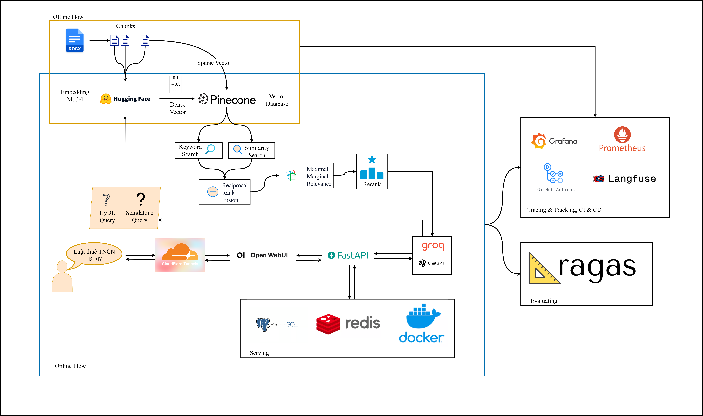
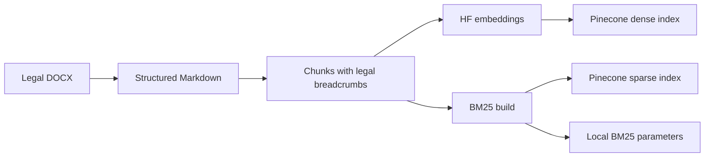
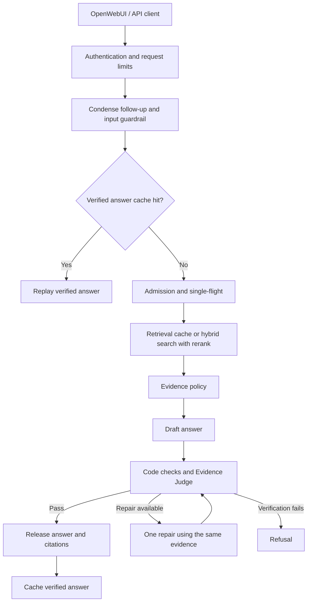
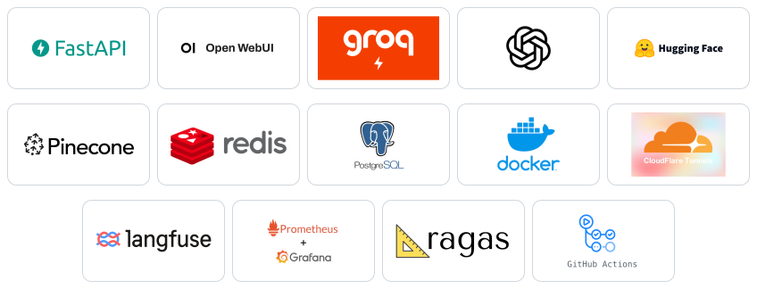
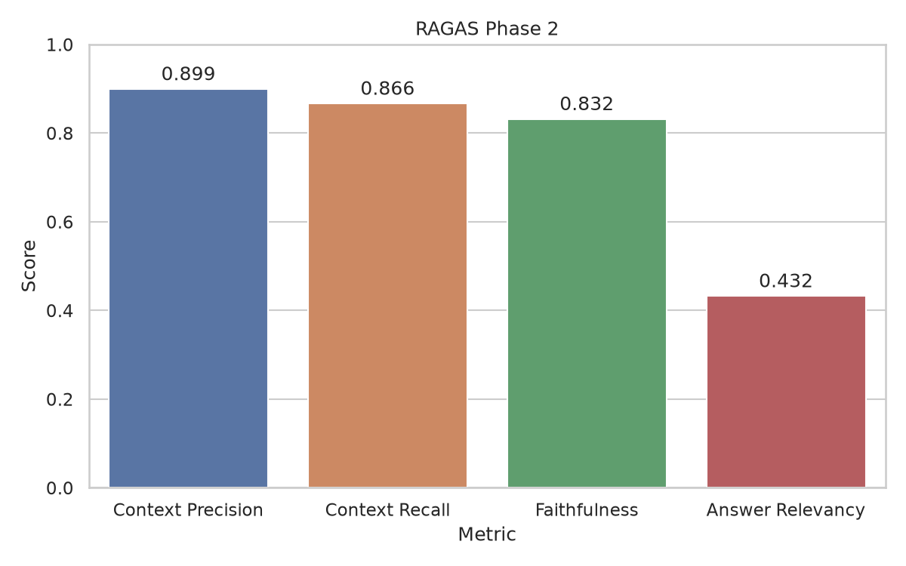
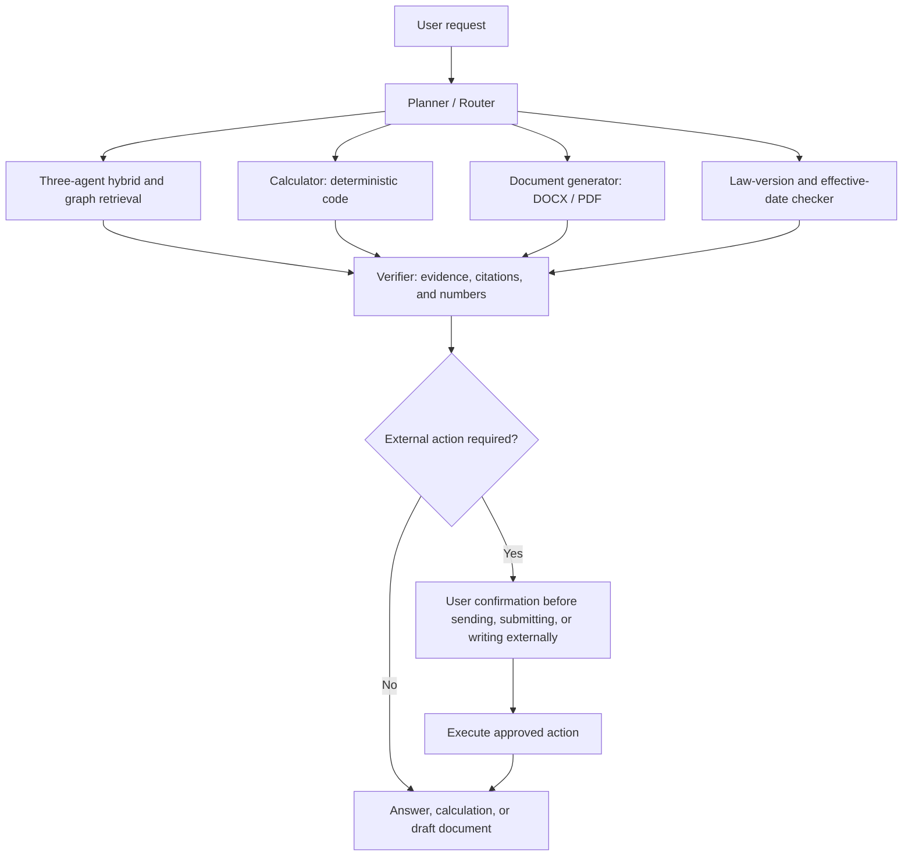
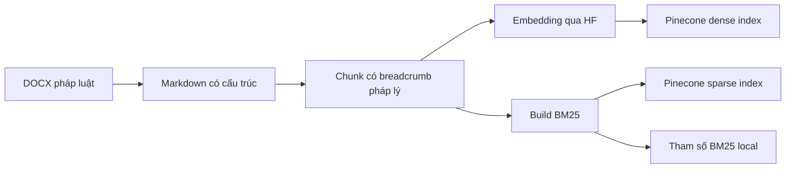
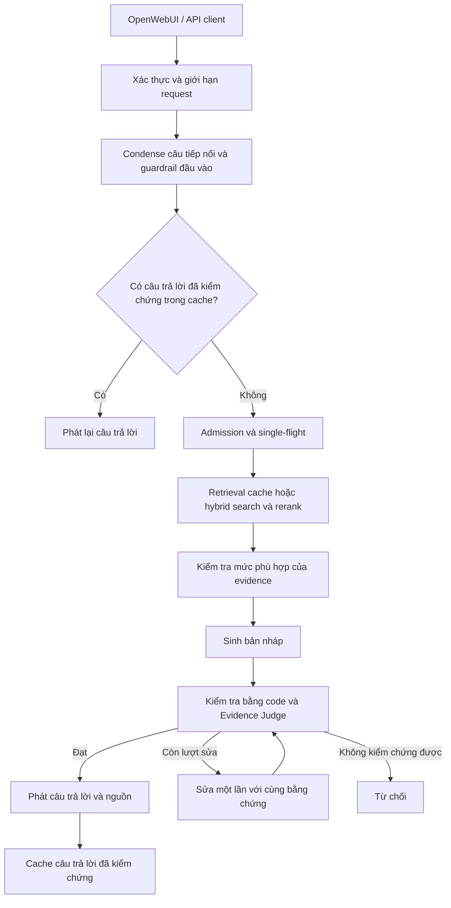
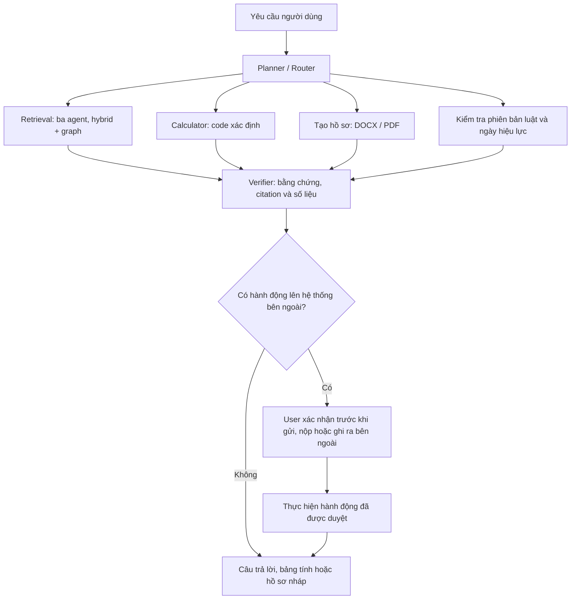

# Vietnamese Legal QA RAG

Evidence-grounded question answering over Vietnamese legal documents, with citation verification and infrastructure for serving users.

[English](#english) · [Tiếng Việt](#tieng-viet)

## Table of Contents

- [English](#english)
  - [Overview](#en-overview)
  - [Key Features &amp; Design Choices](#en-features)
  - [Architecture](#en-architecture)
  - [Tech Stack](#en-stack)
  - [Evaluation &amp; Project Status](#en-evaluation)
  - [Getting Started](#en-setup)
  - [Usage](#en-usage)
  - [Operations &amp; Observability](#en-operations)
  - [Limitations &amp; Roadmap](#en-roadmap)
  - [RAG vs. Agentic Graph RAG (Planned)](#en-agentic)
  - [Project Structure](#en-structure)
  - [Testing &amp; Code Quality](#en-development)
  - [License](#en-license)
- [Tiếng Việt](#tieng-viet)
  - [Tổng quan](#vi-overview)
  - [Tính năng và lựa chọn thiết kế](#vi-features)
  - [Kiến trúc](#vi-architecture)
  - [Công nghệ sử dụng](#vi-stack)
  - [Đánh giá và trạng thái dự án](#vi-evaluation)
  - [Cài đặt và chạy](#vi-setup)
  - [Cách sử dụng](#vi-usage)
  - [Vận hành và quan sát](#vi-operations)
  - [Hạn chế và hướng phát triển](#vi-roadmap)
  - [So sánh RAG và Agentic Graph RAG (dự kiến)](#vi-agentic)
  - [Cấu trúc dự án](#vi-structure)
  - [Kiểm thử và chất lượng code](#vi-development)
  - [Giấy phép](#vi-license)

<a id="english"></a>

## English

<a id="en-overview"></a>

### Overview

- **What:** A Vietnamese legal question-answering chatbot built as a personal project, with an OpenAI-compatible API and OpenWebUI chat interface.
- **Problem:** Legal answers depend on exact provisions, conditions, and exceptions. Keyword lookup can miss paraphrases; an LLM answering from memory can produce unsupported claims or citations.
- **Approach:** Retrieval-augmented generation (RAG): preserve legal structure during ingestion, combine semantic and keyword search, then verify answers against retrieved passages before releasing them.
- **Scope:** The included corpus covers labor law, social insurance, health insurance, personal income tax, minimum wages, and labor relations. Answers depend on this corpus and its document versions.
- **Production focus:** Authentication, request limits, bounded concurrency, caching, container deployment, tracing, and metrics. The deployment targets a single host; broader production readiness requires further validation.

<a id="en-features"></a>

### Key Features & Design Choices

| Design choice                                            | Purpose                                                                                                                                                                        |
| -------------------------------------------------------- | ------------------------------------------------------------------------------------------------------------------------------------------------------------------------------ |
| Structure-aware conversion and chunking                  | Preserve document → Article → Clause → Point breadcrumbs and table content so passages remain identifiable.                                                                 |
| Dense + BM25 retrieval with Reciprocal Rank Fusion (RRF) | Combine semantic matches with literal terms and legal identifiers without adding incompatible search scores.                                                                   |
| HyDE alongside the original query                        | Add a hypothetical legal passage as a semantic search branch while retaining the original wording for exact matches.                                                           |
| Citation-aware candidate retrieval                       | Add structural search terms for explicit Article/Clause references before reranking.                                                                                           |
| Local Vietnamese reranker                                | Rank candidates using the original question; run in-process on GPU or CPU.                                                                                                     |
| Code checks + an independent LLM Evidence Judge          | Check citation references, sensitive numbers, supporting evidence, and material conditions before releasing an answer. Allow at most one repair; refuse if verification fails. |
| Conversation handling, Redis cache, and single-flight    | Resolve follow-up questions, reuse verified answers and retrieval results, and coordinate duplicate work.                                                                      |
| Request limits and admission control                     | Bound concurrent LLM work and queue length; apply per-user request limits and handle provider throttling.                                                                      |

These are engineering choices applied to Vietnamese legal QA. Their quality impact is being evaluated; the project does not yet publish measured superiority over a simpler RAG baseline.

<a id="en-architecture"></a>

### Architecture



**Offline ingestion:**



**One chat turn:**



The diagram shows the main path; guardrail rejection, clarification, and service failures can end a turn earlier. Retrieval combines the original query and a best-effort HyDE branch, dense/sparse search, RRF, optional MMR diversity selection, citation candidates, and reranking. Missing or inadequate evidence is handled before drafting. Answer text is buffered until verification passes, including for streaming requests.

Docker Compose runs the API, OpenWebUI, Redis, PostgreSQL, and Cloudflare Tunnel. PostgreSQL serves OpenWebUI; vectors live in Pinecone. A separate observability stack records traces and metrics.

Design details: [retrieval spec](src/production_legal_qa_rag/retrieval/retrieval_spec.md), [generation spec](src/production_legal_qa_rag/generation/generation_spec.md), [conversation spec](src/production_legal_qa_rag/conversation/conversation_spec.md), and [API spec](src/production_legal_qa_rag/api/api_spec.md).

<a id="en-stack"></a>

### Tech Stack

<p align="center">
  
</p>

| Layer                 | Technology                                                                                                                                              |
| --------------------- | ------------------------------------------------------------------------------------------------------------------------------------------------------- |
| Language and tooling  | Python 3.14, uv, Pydantic v2, Typer                                                                                                                     |
| API and interface     | FastAPI, Uvicorn, OpenAI-compatible chat endpoints, SSE, OpenWebUI                                                                                      |
| LLM inference         | Groq:`openai/gpt-oss-120b` for generation; `openai/gpt-oss-20b` for condense, HyDE, and Judge; `openai/gpt-oss-safeguard-20b` for input guardrail |
| LLM framework         | LangChain (`langchain-openai`, `langchain-text-splitters`)                                                                                              |
| Embeddings            | Hugging Face Inference API,`CODE4LIFEOFFICIAL/huydang-dek21-embedding-v2`, PyVi word segmentation                                                     |
| Retrieval             | Pinecone dense/sparse indexes, BM25, RRF, HyDE, configurable MMR                                                                                        |
| Reranking             | `AITeamVN/Vietnamese_Reranker`, Transformers, PyTorch; local GPU/CPU inference                                                                        |
| State                 | Redis for cache, single-flight, and API request limits; PostgreSQL for OpenWebUI                                                                        |
| Deployment            | Docker Compose, Cloudflare Tunnel                                                                                                                       |
| Observability         | Self-hosted Langfuse, Prometheus, Grafana                                                                                                               |
| Evaluation and checks | RAGAS, pytest, Ruff, mypy, GitHub Actions                                                                                                               |

Model defaults and settings are defined in [config.py](src/production_legal_qa_rag/config.py).

<a id="en-evaluation"></a>

### Evaluation & Project Status

Status as of **October 1, 2026**:

- **Serving:** The ingestion-to-chat pipeline, API, and single-host Docker deployment have been implemented and manually exercised end to end.
- **Observability:** Trace and metrics integration is implemented; manual acceptance of the complete production observability stack is still in progress.
- **Testset:** The synthetic corpus-derived [golden testset](data/eval/phase1/golden_testset.json) contains **157 retained cases: 142 single-hop and 15 specific multi-hop**, selected after reviewing 203 generated cases. It is not an expert-certified legal benchmark.
- **Evaluation:** Phase 2 has run on all 157 cases with the MMR-off retrieval configuration; results are below. The MMR on/off comparison is close and no winning configuration has been declared. Latency and load have not been benchmarked.
- **Delivery:** CI exists. Automated image build/publish to GHCR is planned.

**RAGAS results (157-case testset, MMR off):**



| Metric            | Mean  | Cases scored | Notes                                                                 |
| ----------------- | :---: | :----------: | --------------------------------------------------------------------- |
| Context Precision | 0.899 | 157          | Graded with Claude Haiku.                                             |
| Context Recall    | 0.866 | 157          | MMR on scored 0.841 vs 0.857 for MMR off overall (13 wins, 11 losses, 133 ties). |
| Faithfulness      | 0.832 | 143          | Only answers that were released; 14 of 157 cases were refused.        |
| Answer Relevancy  | 0.432 | 143          | Same 143 answered cases; this is the weakest metric and is not yet analyzed. |

Counting the 14 refused cases as zero, end-to-end Faithfulness is 0.758 and Answer Relevancy 0.394. About 12% of cases needed one repair. Scores measure agreement with LLM-generated references and an LLM judge from the same model family as the generator, so they do not confirm legal correctness. The multi-hop subset (n=15) should be read as a trend only. Reproduce the chart with `uv run python tools/visualize_eval_metrics.py`.

Evaluation compares MMR on/off using `context_recall`, then evaluates a selected configuration with `faithfulness`, `answer_relevancy`, and `context_precision`. The generation stage reads previously retrieved chunks and runs the serving generation logic: draft → deterministic checks → Evidence Judge, with at most one repair followed by re-verification. It bypasses the API, conversation orchestration, condense, input guardrail, and serving caches. Results are checkpointed by case in JSONL and summarized in `data/eval/phase2/report.json`.

The evaluation path uses a separate dependency group and nine Groq keys:

```bash
uv run --group eval --no-group production python tools/run_eval.py status --testset data/eval/phase1/golden_testset.json
uv run --group eval --no-group production python tools/run_eval.py report --testset data/eval/phase1/golden_testset.json
```

See [evaluation_spec.md, section 11](src/production_legal_qa_rag/evaluation/evaluation_spec.md) for stage order, configuration selection, resume rules, and quota handling. These measurements cover retrieval and generation; they do not measure the full conversation, cache, or guardrail path.

<a id="en-setup"></a>

### Getting Started

Run commands from the repository root.

**1. Prerequisites**

- Python 3.14 and uv for host tools and data preparation.
- Docker with the Compose plugin and a Bash shell for deployment.
- Groq, Hugging Face, and Pinecone credentials; access to the configured embedding model through Hugging Face inference.
- RAM and disk space for PyTorch, the reranker checkpoint, and containers. The API container has a 3 GiB memory limit; the full deployment needs additional memory, especially with observability.
- Optional: NVIDIA GPU and NVIDIA Container Toolkit. `deploy/up.sh` detects usable GPU support and otherwise builds the CPU variant.

**2. Clone and configure**

```bash
git clone https://github.com/lndat18/production-legal-qa-rag.git
cd production-legal-qa-rag
uv sync --frozen
cp .env.example .env
```

Use one root `.env` for the app, deployment, and observability. Fill the following before deploying:

| Group                  | Required settings                                                                                               |
| ---------------------- | --------------------------------------------------------------------------------------------------------------- |
| External services      | `GROQ_API_KEY_1`, `HF_TOKEN`, `PINECONE_API_KEY`, `PINECONE_INDEX_NAME`, `PINECONE_SPARSE_INDEX_NAME` |
| Backend authentication | `CHATBOT_API_KEY`                                                                                             |
| Deployment             | `DEPLOY_POSTGRES_USER`, `DEPLOY_POSTGRES_PASSWORD`, `REDIS_PASSWORD`, `WEBUI_SECRET_KEY`                |

Keep the numeric defaults `RATE_LIMIT_PER_MINUTE=5` and `KEEPALIVE_SECONDS=15`, or set valid numbers. Generate a different secret for each secret field; keep `WEBUI_SECRET_KEY` stable across restarts:

```bash
python3 -c "import secrets; print(secrets.token_urlsafe(32))"
```

Production can use key 1 alone. Optional keys 2–4 separate Judge and generation traffic; evaluation requires keys 1–9. Keep `.env` private. [Detailed configuration reference, in Vietnamese](docs/configuration.md).

**3. Prepare the search indexes**

The repository includes raw documents, Markdown, and chunks. To use the included chunks, build your own cloud indexes and local BM25 parameters:

```bash
uv run python tools/embed_documents.py
uv run python tools/sparse_index_documents.py
```

The tools create missing Pinecone indexes using the configured names. Use two separate indexes dedicated to this project. **These commands replace existing vectors in their target indexes.** Run ingestion offline and check the embedding summary for skipped or failed chunks before proceeding. Dense vectors, sparse vectors, and BM25 parameters must describe the same corpus.

For a new or modified corpus, place DOCX documents in `data/raw/` and first run:

```bash
uv run python tools/format_documents.py
uv run python tools/chunk_documents.py
```

Then rebuild both indexes. Formatting uses Groq; embedding uses Hugging Face. These steps consume provider quota. `data/bm25/bm25_params.json` is generated locally and is required when starting the API. The reranker is downloaded on first use and cached; deployment retains its Hugging Face cache volume.

**4. Start the deployment**

```bash
./deploy/up.sh
```

The default `COMPOSE_PROFILES=quick` creates a Cloudflare quick tunnel; the script prints the public OpenWebUI URL. Create the first account, which becomes the administrator, before sharing that URL. Production services do not publish host ports, so the public URL serves the chat interface rather than a directly exposed backend API.

For a fixed domain, configure `COMPOSE_PROFILES=named`, `TUNNEL_TOKEN`, and `WEBUI_URL` following the [deployment spec](deploy/deploy_spec.md). To record production traces, set up [observability](#en-operations) before starting the deployment.

<a id="en-usage"></a>

### Usage

**Chat interface:** Sign in to OpenWebUI, select `legal-qa`, and ask in Vietnamese. For example:

> Điều 113 Bộ luật Lao động quy định gì về nghỉ hằng năm?

A verified answer includes numbered references such as `[1]` and a source list identifying the document and legal breadcrumb. If retrieved evidence cannot support a verified answer, the system returns a clarification, refusal, or evidence/error message as appropriate. Follow-up questions can use the preceding conversation.

**Local API:** Start a local Redis instance or use an existing one. For a new development instance:

```bash
docker run --detach --name legal-qa-dev-redis \
  --publish 127.0.0.1:6379:6379 redis:7-alpine
```

Set `REDIS_URL=redis://localhost:6379/0` in `.env`, complete the app configuration and indexing steps above, then run:

```bash
uv run uvicorn production_legal_qa_rag.api.app:create_app \
  --factory --host 127.0.0.1 --port 8000 --workers 1
```

In another Bash terminal, enter the same `CHATBOT_API_KEY` configured in `.env` at the hidden prompt, then call the API:

```bash
read -rsp 'CHATBOT_API_KEY: ' CHATBOT_API_KEY
curl --silent --show-error http://127.0.0.1:8000/v1/chat/completions \
  -H "Authorization: Bearer ${CHATBOT_API_KEY}" \
  -H 'Content-Type: application/json' \
  -H 'X-OpenWebUI-User-Id: local-demo' \
  --data '{"model":"legal-qa","messages":[{"role":"user","content":"Điều 113 Bộ luật Lao động quy định gì về nghỉ hằng năm?"}],"stream":false}'
```

Use `"stream":true` and `curl --no-buffer` for SSE. The API also provides `GET /v1/models`, `/healthz`, and `/readyz`. Readiness checks Redis; it does not verify Groq or Pinecone availability. User identity headers are trusted only after backend key authentication; keep this shared backend key on trusted clients.

<a id="en-operations"></a>

### Operations & Observability

| Task                             | Command / location                                                                              |
| -------------------------------- | ----------------------------------------------------------------------------------------------- |
| Build/start or update deployment | `./deploy/up.sh`                                                                              |
| Stop deployment, retain volumes  | `./deploy/down.sh`                                                                            |
| Back up OpenWebUI PostgreSQL     | `./deploy/backup.sh` → `deploy/backups/<date>/openwebui.sql.gz`; keeps seven daily backups |
| Clear answer/retrieval cache     | `./deploy/reset_cache.sh`                                                                     |
| Start / stop observability       | `./observability/up.sh` / `./observability/down.sh`                                         |
| Langfuse / Grafana / Prometheus  | `http://localhost:3001` / `http://localhost:3002` / `http://localhost:9092`               |

For initial observability setup, fill the `OBS_*` block in `.env` using its comments, including the required 64-hex-character encryption key. Start `./observability/up.sh`, create a Langfuse project and API keys, and set `LANGFUSE_PUBLIC_KEY` and `LANGFUSE_SECRET_KEY`. Then run `./deploy/up.sh`: it detects the observability network and connects production tracing and metrics. Grafana credentials use `OBS_GRAFANA_ADMIN_USER` and `OBS_GRAFANA_ADMIN_PASSWORD`.

Langfuse is the application's turn-trace store. Turns without working tracing are not recovered later; OpenWebUI separately stores chat history. The PostgreSQL backup command covers OpenWebUI, not the observability stack. OpenWebUI settings saved through the Admin Panel can override Compose defaults on later starts.

See the [configuration reference](docs/configuration.md), [deployment spec](deploy/deploy_spec.md), and [observability spec](src/production_legal_qa_rag/observability/observability_spec.md) for details.

<a id="en-roadmap"></a>

### Limitations & Roadmap

| Current limitation                     | Implication                                                                                                                                 |
| -------------------------------------- | ------------------------------------------------------------------------------------------------------------------------------------------- |
| Limited corpus and document versions   | The system does not independently establish whether a provision is currently in force or covers a user's full situation.                    |
| LLM-based verification                 | A passing Judge verdict reduces unsupported output but does not prove legal correctness; verification also adds latency and consumes quota. |
| External inference and search services | Groq, Hugging Face, and Pinecone availability and quotas affect serving. Self-hosted traces do not make the inference path fully local.     |
| One API worker on one host             | Admission is in-process; scaling to multiple workers or hosts requires revisiting shared concurrency and resource controls.                 |
| Offline full index rebuilds            | Refreshes are not atomic; interrupted publication can temporarily leave an index incomplete.                                                |
| Quick tunnel and host availability     | The default public URL can change; host shutdown, sleep, or connectivity loss interrupts service.                                           |
| Evaluation scope                       | Quality scores cover the MMR-off configuration on a synthetic testset; there are no latency or load benchmark results, and Answer Relevancy is low and unanalyzed. |

Next steps: complete production observability acceptance; analyze the low Answer Relevancy and choose MMR based on further results; use real traces to identify failure cases; add CI image build/publish to GHCR. Moving observability to another host remains an open design decision.

<a id="en-agentic"></a>

### RAG vs. Agentic Graph RAG (Planned)

The next project, [production-legal-agentic-graph-rag](https://github.com/lndat18/production-legal-agentic-graph-rag), is intended to inherit this system's full tech stack and extend retrieval and task execution. **It is a future direction; the comparison below describes intended capabilities, not implemented features or measured improvements.**

**Legend:** ✅ = implemented in the current RAG, or planned for Agentic Graph RAG; ❌ = no dedicated capability in the current system. Every ✅ in the Agentic Graph RAG column is a future target.

| Capability | RAG | Agentic Graph RAG |
| --- | :---: | :---: |
| Vietnamese legal QA with Article/Clause/Point citations | ✅ | ✅ |
| Hybrid dense + BM25 retrieval, HyDE, RRF, optional MMR, and local reranking | ✅ | ✅ |
| Deterministic answer checks and an independent Evidence Judge | ✅ | ✅ |
| Conversation context, caching, API, chat interface, deployment, and observability | ✅ | ✅ |
| RAG quality evaluation with RAGAS | ✅ | ✅ |
| Three cooperating retrieval agents | ❌ | ✅ |
| Decompose and retrieve for requests spanning multiple Clauses or Articles | ❌ | ✅ |
| Follow legal cross-references through a knowledge graph | ❌ | ✅ |
| Plan → retrieve → call tools → verify → produce task outputs | ❌ | ✅ |
| Calculate personal income tax using a code-based calculator and show a per-bracket breakdown | ❌ | ✅ |
| Draft tax forms and export DOCX/PDF files | ❌ | ✅ |
| Analyze user-uploaded employment contracts or invoices | ❌ | ✅ |
| Scheduled law-change monitoring, alerts, and re-indexing | ❌ | ✅ |
| Check provision applicability by effective date and tax period | ❌ | ✅ |
| Connect tools and data sources through MCP | ❌ | ✅ |
| Evaluate agent tool use and task completion with DeepEval | ❌ | ✅ |

**Retrieval direction.** The current design targets questions answerable at Clause level or below. Clause is the default chunk unit; long Clauses can be split further. Retrieval can return multiple chunks, but it has no agentic query decomposition or graph traversal to systematically assemble evidence across Clauses, Articles, and documents. Its multi-hop test cases do not establish reliable coverage of broader requests.

The proposed retrieval design uses **three cooperating agents**, with roles still to be finalized: a **Retrieval Planner** to split the request into subqueries and identify missing evidence; a **Hybrid Retrieval Agent** to search and rerank passages; and a **Graph Retrieval Agent** to follow cross-references and gather connected provisions. LangGraph would coordinate their shared state and bounded follow-up searches before answer verification. This can be described as a **multi-agent retrieval system** if the components make agent-level decisions and exchange results; three fixed LLM calls alone do not establish that architecture. See [LangChain's multi-agent patterns](https://docs.langchain.com/oss/python/langchain/multi-agent).

**Further idea: personal income tax advisory and execution agent.** Beyond answering questions, the agent would plan, retrieve applicable provisions, calculate, and prepare documents. Proposed functions are automatic salary-tax calculation; drafting tax finalization forms or tax-reduction requests; classifying taxable/exempt income from uploaded documents; multi-step advice covering residency, income type, applicable rules, and calculation; and scheduled monitoring of legal changes.

For example, a request such as “Monthly salary VND 40 million, two young children, social insurance VND 4 million—calculate my tax” would trigger clarification of missing information, retrieval of applicable rules, and a calculator tool. The output would include a per-bracket calculation and legal citations.



The calculator owns arithmetic; the LLM extracts parameters. Legal conclusions require Article/Clause citations, applicability checks must use the relevant date and tax period, and missing information prompts a question. Actions that send, submit, or write to an external system require user confirmation.

**Additional technologies to explore:** [LangGraph](https://docs.langchain.com/oss/python/langgraph/overview) for agent orchestration; [Neo4j](https://neo4j.com/docs/getting-started/graph-database/) for legal relationships and cross-references; [Jev by TypeSafe AI](https://typesafe.ai/) for structured routing decisions, with the goal of lowering routing latency and cost; [MCP](https://modelcontextprotocol.io/docs/getting-started/intro) for tool/data-source integration; and [DeepEval](https://deepeval.com/docs/metrics-tool-correctness) for agent evaluation alongside RAGAS. Jev's routing quality, latency, and cost must be measured on this project's requests before adoption.

Evaluation would compare retrieval recall and evidence completeness on Clause-level, broader, and cross-reference cases, plus tool-call accuracy, task success rate, numeric error against deterministic expected results, latency, and cost. Tax cases would include non-residents, multiple income sources, dependents, and effective-date boundaries.

The proposed tax-agent sequence is: **salary-tax calculator → document generator → multi-step planner and verifier → scheduled law monitoring**. These ideas still need a finalized design and implementation.

<a id="en-structure"></a>

### Project Structure

Main packages, pipeline tools, corpus files, and deployment configuration:

```text
production-legal-qa-rag/
├── .github/
│   └── workflows/
│       └── ci.yml                                   # CI checks
├── src/
│   └── production_legal_qa_rag/
│       ├── formatting/                              # DOCX → structured Markdown
│       ├── chunking/                                # Legal structure-aware chunks
│       ├── embedding/                               # Embeddings and dense index publication
│       ├── retrieval/                               # Hybrid search and local reranking
│       ├── generation/                              # Draft, verification, and repair
│       ├── conversation/                            # Turn orchestration and admission
│       ├── cache/                                   # Redis cache and single-flight
│       ├── api/                                     # OpenAI-compatible FastAPI backend
│       ├── observability/                           # Application tracing and metrics
│       ├── evaluation/                              # Testset generation and RAGAS evaluation
│       └── config.py                                # Shared application settings
├── tools/
│   ├── format_documents.py
│   ├── chunk_documents.py
│   ├── embed_documents.py
│   ├── sparse_index_documents.py
│   ├── retrieval.py
│   ├── generation.py
│   ├── conversation.py
│   ├── cache.py
│   ├── api_smoke_test.py
│   ├── generate_testset.py
│   └── run_eval.py
├── tests/                                           # Unit, integration, and acceptance tests
├── data/
│   ├── raw/                                         # Source DOCX documents
│   ├── markdown/                                    # Structured documents
│   ├── chunks/                                      # Chunk JSON files
│   ├── embeddings/                                  # Corpus embedding checkpoints
│   └── eval/
│       ├── units/                                  # Source units for testset generation
│       │   └── units_plan.md                       # Unit generation plan
│       ├── phase1/                                 # Testset generation artifacts and checkpoints
│       │   ├── golden_testset.json                 # Final evaluation testset
│       │   └── golden_testset_review.json          # Sample review decisions
│       └── phase2/                                 # Evaluation stage checkpoints and reports
├── deploy/
│   ├── Dockerfile
│   ├── docker-compose.yml                           # End-user services
│   ├── docker-compose.gpu.yml                       # GPU override
│   ├── docker-compose.observe.yml                   # Observability connection
│   ├── up.sh
│   ├── down.sh
│   ├── backup.sh
│   ├── reset_cache.sh
│   └── deploy_spec.md
├── observability/
│   ├── docker-compose.yml                           # Langfuse, Prometheus, Grafana
│   ├── prometheus.yml
│   ├── grafana/                                     # Grafana provisioning
│   ├── up.sh
│   └── down.sh
├── docs/
│   ├── configuration.md                             # Configuration reference
│   ├── architecture.png
│   └── techstack/                                  # Technology logos
├── .env.example                                     # Environment template
├── .dockerignore
├── .gitignore
├── pyproject.toml                                   # Dependencies and tool configuration
├── uv.lock                                          # Dependency lockfile
├── README.md
└── LICENSE
```

Each business package contains its `<package>_spec.md` alongside the implementation.

<a id="en-development"></a>

### Testing & Code Quality

Read the relevant `<package>_spec.md` before changing a package. Run the standard checks:

```bash
uv sync --frozen
uv run pytest -m "not slow"
uv run ruff check .
uv run ruff format --check .
uv run mypy src
```

Tests that load real models are marked `slow`; run them with `uv run pytest` when needed. RAGAS-dependent tests need the evaluation environment and can be skipped in the default environment:

```bash
uv run --group eval --no-group production pytest -m "not slow"
```

The `production` and `eval` dependency groups conflict by design; select the appropriate environment rather than installing all groups together. [CI workflow](.github/workflows/ci.yml).

<a id="en-license"></a>

### License

Project code is released under the [MIT License](LICENSE). Third-party models, services, and source documents remain subject to their respective licenses and terms.

---

<a id="tieng-viet"></a>

## Tiếng Việt

<a id="vi-overview"></a>

### Tổng quan

- **Project là gì:** Chatbot hỏi đáp pháp luật Việt Nam, phát triển dưới dạng dự án cá nhân, có API tương thích OpenAI và giao diện chat OpenWebUI.
- **Giải quyết vấn đề gì:** Câu trả lời pháp luật phụ thuộc vào đúng quy định, điều kiện và ngoại lệ. Tìm kiếm từ khóa dễ bỏ sót câu hỏi diễn đạt khác; LLM trả lời từ trí nhớ có thể đưa ra khẳng định hoặc viện dẫn thiếu căn cứ.
- **Bằng phương pháp gì:** Retrieval-augmented generation (RAG): giữ cấu trúc pháp lý khi xử lý tài liệu, kết hợp tìm kiếm ngữ nghĩa và từ khóa, rồi kiểm chứng câu trả lời với các đoạn đã truy xuất trước khi phát cho người dùng.
- **Phạm vi:** Corpus đi kèm gồm lao động, bảo hiểm xã hội, bảo hiểm y tế, thuế thu nhập cá nhân, lương tối thiểu và quan hệ lao động. Câu trả lời phụ thuộc vào corpus và phiên bản văn bản trong đó.
- **Hướng production:** Có xác thực, giới hạn request, giới hạn đồng thời, cache, triển khai container, trace và metrics. Thiết kế hiện phục vụ trên một host; khả năng vận hành ở quy mô rộng hơn cần được kiểm chứng thêm.

<a id="vi-features"></a>

### Tính năng và lựa chọn thiết kế

| Lựa chọn thiết kế                                       | Mục đích                                                                                                                                                                                 |
| ----------------------------------------------------------- | ------------------------------------------------------------------------------------------------------------------------------------------------------------------------------------------- |
| Chuyển đổi và chunking theo cấu trúc pháp lý        | Giữ breadcrumb văn bản → Điều → Khoản → Điểm cùng nội dung bảng để xác định được vị trí nguồn.                                                                     |
| Dense + BM25, hợp nhất bằng Reciprocal Rank Fusion (RRF) | Kết hợp kết quả theo ngữ nghĩa với từ khóa và định danh pháp lý, không cộng trực tiếp các loại score khác nhau.                                                        |
| HyDE chạy cùng nhánh câu hỏi gốc                      | Bổ sung đoạn pháp lý giả định cho tìm kiếm ngữ nghĩa, đồng thời giữ câu hỏi gốc để tìm đúng từ và viện dẫn.                                                     |
| Bổ sung candidate theo viện dẫn                          | Thêm tín hiệu cấu trúc cho câu hỏi có Điều/Khoản cụ thể trước khi rerank.                                                                                                    |
| Reranker tiếng Việt chạy local                           | Xếp hạng candidate theo câu hỏi gốc, chạy trong process bằng GPU hoặc CPU.                                                                                                          |
| Kiểm tra bằng code + LLM Evidence Judge độc lập        | Kiểm tra citation, số liệu nhạy cảm, căn cứ và điều kiện trọng yếu trước khi phát câu trả lời. Chỉ sửa tối đa một lần; từ chối nếu không kiểm chứng được. |
| Xử lý hội thoại, Redis cache và single-flight          | Làm rõ câu hỏi tiếp nối, tái sử dụng câu trả lời đã kiểm chứng/kết quả retrieval và điều phối các yêu cầu trùng nhau.                                             |
| Giới hạn request và admission control                    | Giới hạn số lượt gọi LLM đồng thời, độ dài hàng đợi; áp dụng giới hạn request theo user và xử lý throttling từ provider.                                             |

Đây là các lựa chọn kỹ thuật áp dụng cho hỏi đáp pháp luật Việt Nam. Tác động đến chất lượng đang được đánh giá; dự án chưa công bố số đo chứng minh tốt hơn một baseline RAG đơn giản.

<a id="vi-architecture"></a>

### Kiến trúc


**Xử lý tài liệu offline:**



**Một lượt hỏi đáp:**



Sơ đồ thể hiện luồng chính; guardrail chặn, yêu cầu làm rõ hoặc lỗi dịch vụ có thể kết thúc lượt sớm hơn. Retrieval kết hợp câu hỏi gốc và nhánh HyDE best-effort, tìm kiếm dense/sparse, RRF, MMR tùy chọn để chọn candidate đa dạng, candidate theo viện dẫn và reranking. Evidence thiếu hoặc không đủ phù hợp được xử lý trước khi sinh bản nháp. Nội dung câu trả lời được giữ trong buffer đến khi kiểm chứng đạt, kể cả với request streaming.

Docker Compose chạy API, OpenWebUI, Redis, PostgreSQL và Cloudflare Tunnel. PostgreSQL phục vụ OpenWebUI; vector lưu trên Pinecone. Stack observability riêng lưu trace và thu metrics.

Thiết kế chi tiết: [retrieval spec](src/production_legal_qa_rag/retrieval/retrieval_spec.md), [generation spec](src/production_legal_qa_rag/generation/generation_spec.md), [conversation spec](src/production_legal_qa_rag/conversation/conversation_spec.md) và [API spec](src/production_legal_qa_rag/api/api_spec.md).

<a id="vi-stack"></a>

### Công nghệ sử dụng

<p align="center">
  
</p>

| Thành phần              | Công nghệ                                                                                                                                                      |
| ------------------------- | ---------------------------------------------------------------------------------------------------------------------------------------------------------------- |
| Ngôn ngữ và công cụ  | Python 3.14, uv, Pydantic v2, Typer                                                                                                                              |
| API và giao diện        | FastAPI, Uvicorn, endpoint chat tương thích OpenAI, SSE, OpenWebUI                                                                                            |
| LLM inference             | Groq:`openai/gpt-oss-120b` sinh câu trả lời; `openai/gpt-oss-20b` cho condense, HyDE và Judge; `openai/gpt-oss-safeguard-20b` cho guardrail đầu vào |
| LLM framework             | LangChain (`langchain-openai`, `langchain-text-splitters`)                                                                                                       |
| Embedding                 | Hugging Face Inference API,`CODE4LIFEOFFICIAL/huydang-dek21-embedding-v2`, tách từ bằng PyVi                                                                |
| Retrieval                 | Pinecone dense/sparse indexes, BM25, RRF, HyDE, MMR có thể bật/tắt                                                                                           |
| Reranking                 | `AITeamVN/Vietnamese_Reranker`, Transformers, PyTorch; inference local GPU/CPU                                                                                 |
| Trạng thái              | Redis cho cache, single-flight và giới hạn request API; PostgreSQL cho OpenWebUI                                                                              |
| Triển khai               | Docker Compose, Cloudflare Tunnel                                                                                                                                |
| Observability             | Langfuse self-host, Prometheus, Grafana                                                                                                                          |
| Đánh giá và kiểm tra | RAGAS, pytest, Ruff, mypy, GitHub Actions                                                                                                                        |

Model mặc định và các settings nằm trong [config.py](src/production_legal_qa_rag/config.py).

<a id="vi-evaluation"></a>

### Đánh giá và trạng thái dự án

Trạng thái tại **01/10/2026**:

- **Phục vụ người dùng:** Pipeline từ xử lý tài liệu đến hỏi đáp, API và triển khai Docker trên một host đã implement, chạy nghiệm thu thủ công end to end.
- **Observability:** Đã có tích hợp trace và metrics; nghiệm thu thủ công toàn bộ stack observe trên production đang tiếp tục.
- **Testset:** [Golden testset](data/eval/phase1/golden_testset.json) tổng hợp từ corpus gồm **157 mẫu giữ lại: 142 single-hop và 15 multi-hop specific**, sau vòng review 203 mẫu đã sinh. Đây chưa phải benchmark pháp luật được chuyên gia chứng nhận.
- **Evaluation:** Phase 2 đã chạy trên đủ 157 mẫu với cấu hình retrieval MMR tắt; kết quả ở bên dưới. So sánh MMR bật/tắt chênh lệch nhỏ, chưa chọn cấu hình thắng cuộc. Chưa đo độ trễ và tải.
- **Delivery:** Đã có CI. Tự động build/publish image lên GHCR là hạng mục dự kiến.

**Kết quả RAGAS (testset 157 mẫu, MMR tắt):**


| Metric            | Trung bình | Số mẫu chấm | Ghi chú                                                                |
| ----------------- | :--------: | :---------: | ---------------------------------------------------------------------- |
| Context Precision | 0.899      | 157         | Chấm bằng Claude Haiku.                                                |
| Context Recall    | 0.866      | 157         | MMR bật đạt 0.841 so với 0.857 khi tắt (13 thắng, 11 thua, 133 hòa).   |
| Faithfulness      | 0.832      | 143         | Chỉ tính các câu trả lời được phát hành; 14/157 mẫu bị từ chối.        |
| Answer Relevancy  | 0.432      | 143         | Cùng 143 mẫu được trả lời; đây là metric thấp nhất, chưa phân tích nguyên nhân. |

Nếu tính 14 mẫu bị từ chối là 0, Faithfulness end-to-end là 0.758 và Answer Relevancy là 0.394. Khoảng 12% mẫu cần một lần sửa. Điểm đo mức khớp với reference do LLM sinh và judge cùng họ model với generator, nên không xác nhận tính đúng đắn pháp lý. Nhóm multi-hop (n=15) chỉ đọc như xu hướng. Vẽ lại biểu đồ bằng `uv run python tools/visualize_eval_metrics.py`.

Evaluation so sánh MMR bật/tắt bằng `context_recall`, rồi chấm cấu hình được chọn bằng `faithfulness`, `answer_relevancy` và `context_precision`. Stage generation đọc chunks đã truy xuất ở bước trước và chạy logic generation của đường phục vụ người dùng: bản nháp → kiểm tra xác định bằng code → Evidence Judge, với tối đa một lần sửa rồi kiểm chứng lại. Stage này bỏ qua API, điều phối hội thoại, condense, guardrail đầu vào và cache của đường phục vụ. Kết quả được checkpoint theo từng mẫu trong JSONL và tổng hợp tại `data/eval/phase2/report.json`.

Đường evaluation dùng nhóm dependency riêng và chín key Groq:

```bash
uv run --group eval --no-group production python tools/run_eval.py status --testset data/eval/phase1/golden_testset.json
uv run --group eval --no-group production python tools/run_eval.py report --testset data/eval/phase1/golden_testset.json
```

Xem [evaluation_spec.md, mục 11](src/production_legal_qa_rag/evaluation/evaluation_spec.md) để biết thứ tự stage, chọn cấu hình, quy tắc resume và xử lý quota. Các số đo này đánh giá retrieval và generation; không đo toàn bộ luồng hội thoại, cache hoặc guardrail.

<a id="vi-setup"></a>

### Cài đặt và chạy

Chạy các lệnh từ repo root.

**1. Yêu cầu**

- Python 3.14 và uv để chạy tools trên host và chuẩn bị dữ liệu.
- Docker có Compose plugin và Bash để triển khai.
- Key Groq, Hugging Face và Pinecone; quyền truy cập model embedding đã cấu hình qua Hugging Face inference.
- RAM và dung lượng đĩa cho PyTorch, checkpoint reranker và các container. Container API có giới hạn 3 GiB RAM; cả stack cần thêm bộ nhớ, đặc biệt khi bật observability.
- Tùy chọn: GPU NVIDIA và NVIDIA Container Toolkit. `deploy/up.sh` tự dò khả năng sử dụng GPU, nếu không có thì build bản CPU.

**2. Clone và cấu hình**

```bash
git clone https://github.com/lndat18/production-legal-qa-rag.git
cd production-legal-qa-rag
uv sync --frozen
cp .env.example .env
```

Dùng một `.env` ở root cho app, deploy và observability. Điền các biến sau trước khi triển khai:

| Nhóm              | Biến cần điền                                                                                               |
| ------------------ | --------------------------------------------------------------------------------------------------------------- |
| Dịch vụ ngoài   | `GROQ_API_KEY_1`, `HF_TOKEN`, `PINECONE_API_KEY`, `PINECONE_INDEX_NAME`, `PINECONE_SPARSE_INDEX_NAME` |
| Xác thực backend | `CHATBOT_API_KEY`                                                                                             |
| Triển khai        | `DEPLOY_POSTGRES_USER`, `DEPLOY_POSTGRES_PASSWORD`, `REDIS_PASSWORD`, `WEBUI_SECRET_KEY`                |

Giữ mặc định `RATE_LIMIT_PER_MINUTE=5` và `KEEPALIVE_SECONDS=15`, hoặc điền số hợp lệ. Sinh secret riêng cho từng trường bí mật; giữ `WEBUI_SECRET_KEY` cố định qua các lần khởi động:

```bash
python3 -c "import secrets; print(secrets.token_urlsafe(32))"
```

Production có thể chỉ dùng key 1. Key 2–4 tùy chọn để tách tải Judge và generation; evaluation cần đủ key 1–9. Giữ `.env` riêng tư. [Tham chiếu cấu hình chi tiết](docs/configuration.md).

**3. Chuẩn bị search indexes**

Repo có sẵn tài liệu gốc, Markdown và chunks. Để dùng chunks đi kèm, dựng cloud indexes của bạn và tham số BM25 local:

```bash
uv run python tools/embed_documents.py
uv run python tools/sparse_index_documents.py
```

Tools tạo Pinecone indexes còn thiếu theo tên đã cấu hình. Dùng hai indexes riêng dành cho project này. **Các lệnh trên thay thế vector đang có trong indexes đích.** Chạy ingestion offline và kiểm tra tổng kết embedding xem có chunk bị bỏ qua hoặc lỗi trước khi tiếp tục. Dense vectors, sparse vectors và tham số BM25 phải mô tả cùng corpus.

Với corpus mới hoặc đã chỉnh sửa, đặt tài liệu DOCX trong `data/raw/` rồi chạy trước:

```bash
uv run python tools/format_documents.py
uv run python tools/chunk_documents.py
```

Sau đó build lại cả hai indexes. Formatting dùng Groq; embedding dùng Hugging Face. Các bước này tiêu thụ quota của provider. `data/bm25/bm25_params.json` sinh local và bắt buộc có khi khởi động API. Reranker được tải ở lần sử dụng đầu, sau đó dùng cache; deployment giữ volume cache Hugging Face.

**4. Khởi động deployment**

```bash
./deploy/up.sh
```

Mặc định `COMPOSE_PROFILES=quick` tạo Cloudflare quick tunnel; script in URL public của OpenWebUI. Đăng ký tài khoản đầu tiên để làm admin trước khi chia sẻ URL. Các service production không publish cổng host, nên URL public dẫn đến giao diện chat, không trực tiếp expose API backend.

Muốn dùng domain cố định, cấu hình `COMPOSE_PROFILES=named`, `TUNNEL_TOKEN` và `WEBUI_URL` theo [deploy spec](deploy/deploy_spec.md). Để ghi trace production, thiết lập [observability](#vi-operations) trước khi khởi động deployment.

<a id="vi-usage"></a>

### Cách sử dụng

**Giao diện chat:** Đăng nhập OpenWebUI, chọn `legal-qa` và hỏi bằng tiếng Việt. Ví dụ:

> Điều 113 Bộ luật Lao động quy định gì về nghỉ hằng năm?

Câu trả lời đã kiểm chứng có viện dẫn đánh số như `[1]` cùng danh sách nguồn xác định văn bản và breadcrumb pháp lý. Khi evidence truy xuất không hỗ trợ được câu trả lời đã kiểm chứng, hệ thống trả yêu cầu làm rõ, từ chối hoặc thông báo thiếu evidence/lỗi tùy trường hợp. Câu hỏi tiếp nối có thể dùng ngữ cảnh hội thoại trước đó.

**API local:** Chạy Redis local hoặc dùng instance có sẵn. Nếu cần tạo instance dev mới:

```bash
docker run --detach --name legal-qa-dev-redis \
  --publish 127.0.0.1:6379:6379 redis:7-alpine
```

Đặt `REDIS_URL=redis://localhost:6379/0` trong `.env`, hoàn thành cấu hình app và build indexes ở trên, rồi chạy:

```bash
uv run uvicorn production_legal_qa_rag.api.app:create_app \
  --factory --host 127.0.0.1 --port 8000 --workers 1
```

Trong terminal Bash khác, nhập đúng `CHATBOT_API_KEY` đã cấu hình trong `.env` tại prompt ẩn, rồi gọi API:

```bash
read -rsp 'CHATBOT_API_KEY: ' CHATBOT_API_KEY
curl --silent --show-error http://127.0.0.1:8000/v1/chat/completions \
  -H "Authorization: Bearer ${CHATBOT_API_KEY}" \
  -H 'Content-Type: application/json' \
  -H 'X-OpenWebUI-User-Id: local-demo' \
  --data '{"model":"legal-qa","messages":[{"role":"user","content":"Điều 113 Bộ luật Lao động quy định gì về nghỉ hằng năm?"}],"stream":false}'
```

Dùng `"stream":true` và `curl --no-buffer` để nhận SSE. API còn có `GET /v1/models`, `/healthz` và `/readyz`. Readiness kiểm tra Redis, không kiểm tra trạng thái Groq hoặc Pinecone. Header danh tính user chỉ được tin sau khi xác thực key backend; chỉ đặt key dùng chung này trên client đáng tin cậy.

<a id="vi-operations"></a>

### Vận hành và quan sát

| Tác vụ                                       | Lệnh / địa chỉ                                                                               |
| ---------------------------------------------- | ------------------------------------------------------------------------------------------------ |
| Build/khởi động hoặc cập nhật deployment | `./deploy/up.sh`                                                                               |
| Dừng deployment, giữ volumes                 | `./deploy/down.sh`                                                                             |
| Backup PostgreSQL của OpenWebUI               | `./deploy/backup.sh` → `deploy/backups/<ngày>/openwebui.sql.gz`; giữ bảy bản theo ngày |
| Xóa cache câu trả lời/retrieval            | `./deploy/reset_cache.sh`                                                                      |
| Bật / tắt observability                      | `./observability/up.sh` / `./observability/down.sh`                                          |
| Langfuse / Grafana / Prometheus                | `http://localhost:3001` / `http://localhost:3002` / `http://localhost:9092`                |

Lần đầu thiết lập observability, điền block `OBS_*` trong `.env` theo comment, bao gồm encryption key bắt buộc 64 ký tự hex. Chạy `./observability/up.sh`, tạo project và API keys trên Langfuse, rồi điền `LANGFUSE_PUBLIC_KEY` và `LANGFUSE_SECRET_KEY`. Sau đó chạy `./deploy/up.sh`: script phát hiện network observability và nối trace/metrics production. Tài khoản Grafana dùng `OBS_GRAFANA_ADMIN_USER` và `OBS_GRAFANA_ADMIN_PASSWORD`.

Langfuse là nơi lưu turn trace của ứng dụng. Những lượt không ghi trace được sẽ không khôi phục lại sau đó; OpenWebUI lưu lịch sử chat riêng. Lệnh backup PostgreSQL chỉ backup OpenWebUI, không backup stack observability. Cấu hình OpenWebUI đã lưu qua Admin Panel có thể đè mặc định trong Compose ở các lần khởi động sau.

Xem [tham chiếu cấu hình](docs/configuration.md), [deploy spec](deploy/deploy_spec.md) và [observability spec](src/production_legal_qa_rag/observability/observability_spec.md) để biết chi tiết.

<a id="vi-roadmap"></a>

### Hạn chế và hướng phát triển

| Hạn chế hiện tại                                   | Ảnh hưởng                                                                                                                                                      |
| ------------------------------------------------------ | ----------------------------------------------------------------------------------------------------------------------------------------------------------------- |
| Corpus và phiên bản văn bản có giới hạn        | Hệ thống không độc lập xác nhận hiệu lực hiện tại của quy định hoặc việc bao phủ đầy đủ tình huống người hỏi.                          |
| Kiểm chứng bằng LLM                                 | Judge đạt giúp giảm đầu ra thiếu căn cứ nhưng không chứng minh tính đúng đắn pháp lý; kiểm chứng cũng tăng độ trễ và tiêu thụ quota. |
| Phụ thuộc dịch vụ inference và search bên ngoài | Trạng thái và quota Groq, Hugging Face, Pinecone ảnh hưởng đến phục vụ. Trace self-host không đồng nghĩa inference hoàn toàn local.               |
| Một API worker trên một host                        | Admission nằm trong process; mở rộng nhiều worker/host cần thiết kế lại kiểm soát đồng thời và tài nguyên dùng chung.                            |
| Full rebuild indexes offline                           | Refresh không atomic; lỗi giữa lúc publish có thể tạm thời để lại index chưa đầy đủ.                                                              |
| Quick tunnel và trạng thái host                     | URL public mặc định có thể đổi; máy tắt, sleep hoặc mất kết nối sẽ gián đoạn dịch vụ.                                                          |
| Phạm vi đánh giá                                    | Điểm chất lượng chỉ cho cấu hình MMR tắt trên testset tổng hợp; chưa có benchmark độ trễ hoặc tải, và Answer Relevancy thấp, chưa phân tích.        |

Bước tiếp theo: hoàn tất nghiệm thu observability production; phân tích Answer Relevancy thấp và chọn MMR theo kết quả đánh giá thêm; dùng trace thật để tìm các ca lỗi; bổ sung CI build/publish image lên GHCR. Tách observability sang host khác vẫn là quyết định thiết kế chưa chốt.

<a id="vi-agentic"></a>

### So sánh RAG và Agentic Graph RAG (dự kiến)

Phiên bản tiếp theo, [production-legal-agentic-graph-rag](https://github.com/lndat18/production-legal-agentic-graph-rag), dự kiến kế thừa toàn bộ tech stack của hệ thống này, mở rộng retrieval và khả năng thực hiện tác vụ. **Đây là hướng phát triển tương lai; bảng dưới mô tả mục tiêu, chưa phải tính năng đã triển khai hay kết quả cải thiện đã đo được.**

**Ký hiệu:** ✅ = đã có ở RAG hiện tại, hoặc dự kiến có ở Agentic Graph RAG; ❌ = hệ thống hiện tại chưa có cơ chế chuyên biệt cho chức năng đó. Mọi dấu ✅ ở cột Agentic Graph RAG đều là mục tiêu tương lai.

| Khả năng | RAG | Agentic Graph RAG |
| --- | :---: | :---: |
| Hỏi đáp pháp luật Việt Nam, trích dẫn Điều/Khoản/Điểm | ✅ | ✅ |
| Hybrid dense + BM25, HyDE, RRF, MMR tùy chọn và reranker local | ✅ | ✅ |
| Kiểm tra câu trả lời bằng code và Evidence Judge độc lập | ✅ | ✅ |
| Ngữ cảnh hội thoại, cache, API, giao diện chat, deploy và observability | ✅ | ✅ |
| Đánh giá chất lượng RAG bằng RAGAS | ✅ | ✅ |
| Ba agent phối hợp trong retrieval | ❌ | ✅ |
| Phân rã yêu cầu và truy xuất tổng hợp nhiều Khoản hoặc Điều | ❌ | ✅ |
| Lần theo viện dẫn chéo giữa các quy định bằng knowledge graph | ❌ | ✅ |
| Lập kế hoạch → truy xuất → gọi tool → kiểm chứng → tạo kết quả tác vụ | ❌ | ✅ |
| Tính thuế TNCN bằng calculator viết bằng code, kèm bảng tính từng bậc | ❌ | ✅ |
| Soạn hồ sơ thuế và xuất DOCX/PDF | ❌ | ✅ |
| Phân tích hợp đồng lao động hoặc hóa đơn do user upload | ❌ | ✅ |
| Theo dõi thay đổi luật định kỳ, cảnh báo và re-index | ❌ | ✅ |
| Kiểm tra quy định áp dụng theo ngày hiệu lực và kỳ tính thuế | ❌ | ✅ |
| Kết nối tool và nguồn dữ liệu qua MCP | ❌ | ✅ |
| Đánh giá việc dùng tool và hoàn thành tác vụ bằng DeepEval | ❌ | ✅ |

**Hướng cải tiến retrieval.** Thiết kế hiện tại tập trung vào câu hỏi có thể trả lời ở phạm vi một Khoản hoặc nhỏ hơn. Khoản là đơn vị chunk mặc định; Khoản dài có thể được tách nhỏ. Retrieval có thể trả nhiều chunk, nhưng chưa có cơ chế agentic để phân rã câu hỏi hoặc duyệt graph nhằm tập hợp có hệ thống bằng chứng trải qua nhiều Khoản, Điều và văn bản. Các ca multi-hop trong testset chưa chứng minh khả năng xử lý ổn định mọi yêu cầu rộng hơn một Khoản.

Hướng đề xuất dùng **ba agent phối hợp**, vai trò cụ thể còn cần chốt: **Retrieval Planner** phân rã yêu cầu thành câu hỏi con và xác định bằng chứng còn thiếu; **Hybrid Retrieval Agent** tìm kiếm, rerank các đoạn luật; **Graph Retrieval Agent** lần theo viện dẫn chéo để bổ sung quy định liên quan. LangGraph điều phối trạng thái chung và các lượt truy xuất bổ sung có giới hạn trước khi kiểm chứng câu trả lời. Có thể gọi đây là **multi-agent retrieval system** nếu các thành phần có khả năng quyết định ở cấp agent và trao đổi kết quả; chỉ gọi LLM ba lần theo luồng cố định chưa đủ để xác lập kiến trúc đó. Tham khảo [các mẫu multi-agent của LangChain](https://docs.langchain.com/oss/python/langchain/multi-agent).

**Ý tưởng mở rộng: agent tư vấn + thực thi thuế TNCN.** Ngoài trả lời, agent sẽ lập kế hoạch, truy xuất quy định áp dụng, tính toán và tạo hồ sơ. Các chức năng dự kiến gồm tính thuế tiền lương tự động; soạn tờ khai quyết toán hoặc đơn đề nghị giảm thuế; phân loại thu nhập chịu thuế/miễn thuế từ tài liệu upload; tư vấn nhiều bước từ tình trạng cư trú → loại thu nhập → quy định áp dụng → tính toán; và theo dõi thay đổi luật định kỳ.

Ví dụ, với yêu cầu “Lương 40 triệu/tháng, 2 con nhỏ, đóng BHXH 4 triệu, tính thuế giúp”, agent sẽ hỏi lại thông tin còn thiếu, truy xuất quy định áp dụng rồi gọi calculator tool. Kết quả kèm bảng tính từng bậc thuế và trích dẫn pháp luật.



Phép tính luôn đi qua code, LLM chỉ trích tham số. Mỗi kết luận pháp lý phải có citation Điều/Khoản; kiểm tra hiệu lực phải xét ngày áp dụng và kỳ tính thuế; thiếu thông tin thì hỏi lại. Hành động gửi, nộp hoặc ghi lên hệ thống bên ngoài phải được user xác nhận.

**Công nghệ bổ sung dự kiến nghiên cứu:** [LangGraph](https://docs.langchain.com/oss/python/langgraph/overview) để điều phối agent; [Neo4j](https://neo4j.com/docs/getting-started/graph-database/) để lưu quan hệ pháp lý và viện dẫn chéo; [Jev của TypeSafe AI](https://typesafe.ai/) cho quyết định routing có cấu trúc, hướng đến giảm độ trễ và chi phí router; [MCP](https://modelcontextprotocol.io/docs/getting-started/intro) để tích hợp tool/nguồn dữ liệu; và [DeepEval](https://deepeval.com/docs/metrics-tool-correctness) để đánh giá agent bên cạnh RAGAS. Chất lượng routing, độ trễ và chi phí Jev cần được đo trên request của dự án trước khi lựa chọn.

Đánh giá sẽ so sánh retrieval recall và độ đầy đủ bằng chứng trên câu hỏi trong một Khoản, vượt một Khoản và có viện dẫn chéo; đồng thời đo tool-call accuracy, task success rate, sai lệch số liệu so với đáp án tính bằng code, độ trễ và chi phí. Bộ ca thuế sẽ có người không cư trú, nhiều nguồn thu nhập, người phụ thuộc và ranh giới ngày hiệu lực.

Lộ trình đề xuất cho agent thuế: **calculator thuế tiền lương → tạo hồ sơ → planner nhiều bước và verifier → theo dõi luật định kỳ**. Các ý tưởng này còn cần chốt thiết kế và triển khai.

<a id="vi-structure"></a>

### Cấu trúc dự án

Các package chính, tools pipeline, dữ liệu corpus và cấu hình triển khai:

```text
production-legal-qa-rag/
├── .github/
│   └── workflows/
│       └── ci.yml                                   # Kiểm tra CI
├── src/
│   └── production_legal_qa_rag/
│       ├── formatting/                              # DOCX → Markdown có cấu trúc
│       ├── chunking/                                # Chunk theo cấu trúc pháp lý
│       ├── embedding/                               # Embedding và publish dense index
│       ├── retrieval/                               # Hybrid search và rerank local
│       ├── generation/                              # Sinh bản nháp, kiểm chứng và sửa
│       ├── conversation/                            # Điều phối lượt hỏi và admission
│       ├── cache/                                   # Redis cache và single-flight
│       ├── api/                                     # Backend FastAPI tương thích OpenAI
│       ├── observability/                           # Trace và metrics trong ứng dụng
│       ├── evaluation/                              # Sinh testset và đánh giá RAGAS
│       └── config.py                                # Settings dùng chung của ứng dụng
├── tools/
│   ├── format_documents.py
│   ├── chunk_documents.py
│   ├── embed_documents.py
│   ├── sparse_index_documents.py
│   ├── retrieval.py
│   ├── generation.py
│   ├── conversation.py
│   ├── cache.py
│   ├── api_smoke_test.py
│   ├── generate_testset.py
│   └── run_eval.py
├── tests/                                           # Unit, integration và acceptance tests
├── data/
│   ├── raw/                                         # Tài liệu DOCX nguồn
│   ├── markdown/                                    # Văn bản có cấu trúc
│   ├── chunks/                                      # Chunks dạng JSON
│   ├── embeddings/                                  # Checkpoint embedding corpus
│   └── eval/
│       ├── units/                                  # Đơn vị nguồn để sinh testset
│       │   └── units_plan.md                       # Kế hoạch sinh theo đơn vị
│       ├── phase1/                                 # Dữ liệu và checkpoint sinh testset
│       │   ├── golden_testset.json                 # Testset đánh giá cuối
│       │   └── golden_testset_review.json          # Quyết định review từng mẫu
│       └── phase2/                                 # Checkpoint các stage và báo cáo đánh giá
├── deploy/
│   ├── Dockerfile
│   ├── docker-compose.yml                           # Các service phục vụ người dùng
│   ├── docker-compose.gpu.yml                       # Override cho GPU
│   ├── docker-compose.observe.yml                   # Kết nối với observability
│   ├── up.sh
│   ├── down.sh
│   ├── backup.sh
│   ├── reset_cache.sh
│   └── deploy_spec.md
├── observability/
│   ├── docker-compose.yml                           # Langfuse, Prometheus, Grafana
│   ├── prometheus.yml
│   ├── grafana/                                     # Cấu hình provisioning Grafana
│   ├── up.sh
│   └── down.sh
├── docs/
│   ├── configuration.md                             # Tham chiếu cấu hình
│   ├── architecture.png
│   └── techstack/                                  # Logo các công nghệ
├── .env.example                                     # Mẫu biến môi trường
├── .dockerignore
├── .gitignore
├── pyproject.toml                                   # Dependencies và cấu hình công cụ
├── uv.lock                                          # Khóa phiên bản dependencies
├── README.md
└── LICENSE
```

Mỗi package nghiệp vụ có `<package>_spec.md` nằm cạnh phần implementation.

<a id="vi-development"></a>

### Kiểm thử và chất lượng code

Đọc `<package>_spec.md` tương ứng trước khi sửa package. Chạy các kiểm tra chuẩn:

```bash
uv sync --frozen
uv run pytest -m "not slow"
uv run ruff check .
uv run ruff format --check .
uv run mypy src
```

Test nạp model thật được đánh dấu `slow`; chạy bằng `uv run pytest` khi cần. Test phụ thuộc RAGAS cần môi trường evaluation và có thể bị skip trong môi trường mặc định:

```bash
uv run --group eval --no-group production pytest -m "not slow"
```

Nhóm dependency `production` và `eval` xung đột có chủ đích; chọn môi trường phù hợp thay vì cài toàn bộ groups cùng lúc. [CI workflow](.github/workflows/ci.yml).

<a id="vi-license"></a>

### Giấy phép

Code của project được phát hành theo [MIT License](LICENSE). Model, dịch vụ bên thứ ba và văn bản nguồn tuân theo giấy phép và điều khoản tương ứng của chúng.
