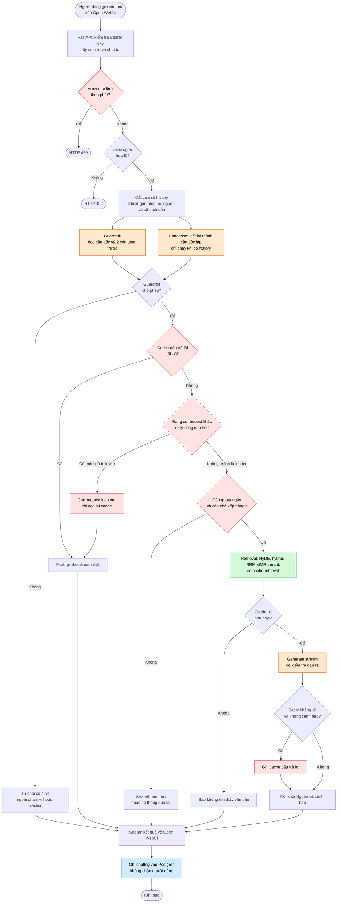

# Luồng xử lý một câu hỏi (Activity diagram)

Hình mô tả những gì `ChatOrchestrator` làm cho **một câu hỏi** của người dùng, kể cả các nhánh
rẽ (từ chối, cache trúng, hết hạn mức, lỗi). Chi tiết từng bước: `conversation_spec.md`,
`cache_spec.md`, `api_spec.md`.

Màu: cam = Groq (LLM), đỏ = Redis, xanh lá = retrieval (HF, Pinecone, reranker),
xanh dương = Postgres. Ô bo tròn = điểm bắt đầu/kết thúc; hình thoi = điểm rẽ nhánh.

## Ghi chú đọc hình

- **Song song:** Guardrail và Condense chạy cùng lúc, rồi gặp nhau ở điểm rẽ "Guardrail cho
  phép?". Lượt đầu tiên (chưa có history) thì Condense bỏ qua.
- **Chỉ tốn LLM khi cache trượt:** quota ngày và hàng đợi chỉ áp dụng sau khi cache câu trả lời
  không trúng.
- **Single-flight:** khi 50 người hỏi cùng một câu lúc cache còn trống, chỉ 1 request (leader) gọi
  LLM; các request còn lại (follower) chờ rồi đọc cache, không chiếm slot và không tốn quota.
  Nếu leader lỗi hoặc chờ quá lâu, follower tự thử làm leader (chưa vẽ).
- **Mọi nhánh sau bước kiểm tra đầu vào đều đi về "Stream kết quả"** rồi ghi chatlog, kể cả từ
  chối và lỗi, nên mỗi lượt được nhận đều có đúng 1 dòng log. Request bị chặn từ đầu bằng HTTP
  429/422 chưa thành "lượt" nên không có dòng log.
- Chưa vẽ: guardrail lỗi (fail-open, coi như cho phép) và condense lỗi (dùng câu gốc).
- Chưa vẽ: nhánh lỗi giữa chừng (Groq 429, stream đứt) — chúng rẽ ra từ bước Retrieval/Generate
  về "Stream kết quả" dưới dạng thông báo lỗi.
